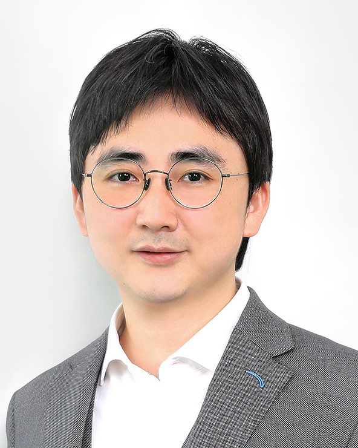

<table class="imgtable">
    <tr>
        <td style="width:256px">
             
        </td>
            
        <td align="left">
            
<h5>Zecheng Gan (干则成)</h5>  <a href="https://funh.hkust-gz.edu.cn/en" >Advanced Materials Thrust (GZ)</a> and <a href="https://www.math.hkust.edu.hk/" >Department of Mathematics (CWB)</a>    <a href="https://hkust-gz.edu.cn/">The Hong Kong University of Science and Technology</a>  

        </td>
	</tr>
</table>

## Contact
- E-mail: zechenggan@ust.hk
- Office: FYTRI/CWB

## Research interests
&emsp; Scientific Computing, Applied Mathematics, Electromagnetics, Hydrodynamics, Data-driven and Machine Learning methods for Science & Engineering.

## Short bio
- <b>Tenure-track Assistant Professor (2021.09-now)</b>   &ensp; Advanced Materials Thrust, Function Hub, The Hong Kong University of Science and Technology (GZ).
- <b>Affiliate Assistant Professor (2021.09-now)</b>   &ensp; Department of Mathematics, School of Science, The Hong Kong University of Science and Technology (CWB).
- <b>Postdoc associate</b> (2019.08-2021.08)   &ensp; Courant Institute of Mathematical Sciences, New York University.
- <b>Postdoc assistant professor</b> (2016.09-2019.07)   &ensp; Department of Mathematics, University of Michigan, Ann Arbor.
- <b>Ph.D. in Mathematics</b> (2016.06)   &ensp; Department of Mathematics and Institute of Natural Sciences, Shanghai Jiao Tong University. 
- <b>B.S. in Mechanical Engineering</b> (2010.06)   &ensp; School of Mechanical Engineering, Shanghai Jiao Tong University.
<!-- - <b>B.S. in Electrical & Information Engineering</b> (2010.06)   &ensp; School of Telecommunication and Information Engineering, Nanjing University of Posts and Telecommunications. -->

### Detailed CV: available upon request.
