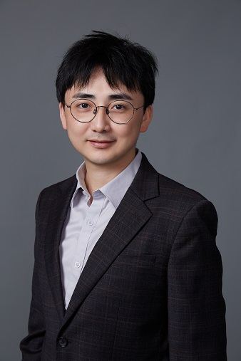

<table class="imgtable">
    <tr>
        <td style="width:256px">
             
        </td>
            
        <td align="left">
            
<h5>Zecheng Gan (干则成)</h5>  <a href="https://funh.hkust-gz.edu.cn/en" >Advanced Materials Thrust (GZ)</a> and <a href="https://www.math.hkust.edu.hk/" >Department of Mathematics (CWB)</a>    <a href="https://hkust-gz.edu.cn/">The Hong Kong University of Science and Technology</a>  

        </td>
	</tr>
</table>

## Contact
- E-mail: zechenggan@ust.hk; and zechenggan@hkust-gz.edu.cn
- Office: W1-505

## Research interests
&emsp; Scientific Computing, Applied Mathematics, Electromagnetics, Hydrodynamics, Data-driven and Machine Learning methods for Science & Engineering.

## Short bio
- <b>Tenure-track Assistant Professor (2021.09-now)</b>   &ensp; Advanced Materials Thrust, Function Hub, The Hong Kong University of Science and Technology (GZ).
- <b>Assistant Professor (joint appointment) (2022.07-now)</b>   &ensp; Department of Mathematics, School of Science, The Hong Kong University of Science and Technology (CWB).
- <b>Affiliate Assistant Professor (2021.09-2022.06)</b>   &ensp; Department of Mathematics, School of Science, The Hong Kong University of Science and Technology (CWB).
- <b>Postdoc associate</b> (2019.08-2021.08)   &ensp; Courant Institute of Mathematical Sciences, New York University.
- <b>Postdoc assistant professor</b> (2016.09-2019.07)   &ensp; Department of Mathematics, University of Michigan, Ann Arbor.
- <b>Ph.D. in Mathematics</b> (2016.06)   &ensp; Department of Mathematics and Institute of Natural Sciences, Shanghai Jiao Tong University. 
- <b>B.S. in Mechanical Engineering</b> (2010.06)   &ensp; School of Mechanical Engineering, Shanghai Jiao Tong University.
<!-- - <b>B.S. in Electrical & Information Engineering</b> (2010.06)   &ensp; School of Telecommunication and Information Engineering, Nanjing University of Posts and Telecommunications. -->

### Detailed CV: available upon request.

## News and Events

### Research
- 2025.01 Paper "Fast algorithm for quasi-2D Coulomb systems" published on J. Comput. Phys.
- 2024.07 Paper "Broken symmetries in quasi-2D charged systems via negative dielectric confinement" published on J. Chem. Phys.
- 2024.01 We are funded by Guangzhou-HKUST(GZ) Joint research fund.
- 2023.01 We are funded by Guangdong Basic and Applied Basic Research Foundation.
- 2022.09 We are funded by National Science Foundation of China.
- 2022.07 We are funded by Guangzhou Basic and applied basic research Foundation.
- 2021.02 Paper "Harmonic Surface Mapping Algorithm for Electrostatic Potentials in an Atomistic/Continuum Hybrid Model for Electrolyte Solutions" published on Commun. Comput. Phys.
- 2020.01 Paper "Efficient dynamic simulations of charged dielectric colloids through a novel hybrid
method" <a href="https://aip.scitation.org/action/doSearch?SeriesKey=jcp&AllField=JCP+Editors%E2%80%99+Choice+2019&ConceptID=208566&startPage=&content=collectionsSearch&target=issue-collections-search">selected as JCP Editor's Choice 2019</a>.

### Group
- 2025.02 Yilin Li, currently undergraduate in math at Nankai University, joined the group as a research intern. Welcome, Yilin!
- 2024.11 Yanqiao (Marvel) Li, graduate from CUHK-SZ (Nobel class), joined the group as a research assistant. Welcome, Marvel!
- 2024.09 Kaiwen Jin, graduate from Nankai University (Math), joined the group as a PhD candidate (co-supervising with Prof. Jin-Guo Liu). Welcome, Kaiwen!
- 2024.09 Xuanyan Chen, graduate from the red bird master (RBM) program, HKUST(GZ), joined the group as a PhD candidate. Welcome, Xuanyan!
- 2024.02 I am co-supervising red bird MPhil (RBM) student Lingchuan Tan. Welcome, Lingchuan!
- 2024.02 Qian (Serena) Hou, graduate from Shanghai Normal University(Statistics), joined the group as a PhD candidate. Welcome, Serena!
- 2023.09 I am supervising red bird MPhil (RBM) student Shiyi Bai. Welcome, Shiyi!
- 2023.09 I am co-supervising Fintech PhD student Zichun Wang. Welcome, Zichun!
- 2023.09 Weitao Lan, graduate from Peking University(CS), joined the group as a PhD candidate. Welcome, Weitao!
- 2023, summer Zhuoma Wang, PhD student from HKUST (MAE department), joined the group as a cross-campus exchange student. Welcome, Zhuoma!  
- 2022.09 Yanyu Duan, graduate from HIT-SZ(physics), joined the group as a PhD candidate. Welcome, Yanyu!
- 2022.09 Tianhao Hu, undergraduate from Wuhan University (school of mathematical science), joined the group as a PhD candidate. Welcome, Tianhao!
- 2022, summer Wenjun Li, incoming red bird MPhil student, joined the group as a research intern. Welcome, Wenjun!  
- 2022, summer Yue Fang, PhD student from HKUST (CBE department), joined the group as a cross-campus exchange student. Welcome, Yue!  
- 2022.02 Zheng (Johnson) Yang, graduate from University of Manchester, joined the group as a PhD candidate. Welcome, Johnson!  
- 2021.10 I am co-advising MPhil student Wing Chun (Kyle) Chan with Prof. Rui Zhang. Welcome, Kyle! 
- 2021.10 I am co-advising PhD candidate Jiayi Wang (Chemical Engineering) with Prof. Ping Gao. Welcome, Jiayi! 
- 2021.09 Xuanzhao Gao, undergraduate from USTC (school of gifted young), joined the group as a PhD candidate. Welcome, Xuanzhao!

### Events and Activities  
- 2025.01 Z. Gan is giving an invited popular science lecture on “Materials science & AI” to Puning experimental high school students.
- 2025.01 Z. Gan is co-organizing the "6th Greater Bay Area Soft Matter and Life Matter Forum" together with Profs. Weijia Wen (Chair), Penger Tong, Xiakun Chu, Rui Zhang, Qin Xu et al.
- 2024.12 Z. Gan is giving an invited talk at the "Workshop on mathematics for science and engineering", SJTU
- 2024.12 Z. Gan is giving an invited talk at the "Workshop on applied and computational mathematics", Guangdong University of Technology
- 2024.12 Z. Gan is giving an invited talk at the "Workshop on scientific computing and machine learning", SJTU
- 2024.11 Z. Gan is co-organizing (and also giving a talk) at the "Cross-Campus Workshop on Chemistry and Materials Reasearch" together with Prof. Gao (Chair), et al.
- 2024.10 Z. Gan is co-organizing the outreach activity "math source tour at UIC" together with UG student Guofu Tang and Prof. Yi-lung Kuo.
- 2024.10 Z. Gan is giving an invited talk at the CSIAM annual conference, Nanjing.
- 2024.10 Organizer, Public talk on “Successful publishing with ACS and Nano Letters”; Speaker: Prof. Elena Besley (Head of Materials Chemistry, University of Nottingham; and Associate editor at Nano Letters).
- 2024.10 Z. Gan is organizing a miniworkshop on "Electrostatics in Advanced Materials (2024)" together with Profs. Ho-Kei Chan. Invited speakers: Profs. Elena Besley (University of Nottingham), Rene Messina (University of Lorraine), Decai Huang (NJUST), etc. <b>on the newsletter of Institute of Physics (IOP), 2024 winter</b>.
- 2024.08 Z. Gan is giving an invited talk at the Conference of Scientific Machine Learning (CSML2024), Shanghai.
- 2024.08 Z. Gan is giving an invited talk at the Joint Annual Conference of Physical Societies in Guangdong-Hong Kong-Macao Greater Bay Area, Macao
- 2024.07 Z. Gan is giving an invited talk at the International Conference on Scientific Computation and Differential Equations (SciCADE2024), National University of Singapore
- 2024.06 Z. Gan is giving an invited talk at the East Asia Section of SIAM (EASIAM 2024), University of Macau
- 2023.12 Z. Gan is giving an invited talk at the Quantum Materials & Materials Informatics Symposium.
- 2023.11 Z. Gan is organizing the minisymposium on “Modeling and Simulation for Materials Science and Deep Learning”, EASIAM 2024, together with Prof. Yuqing Li (SJTU).
- 2023.11 Z. Gan is co-organizing the "Cross-Campus Workshop on Biology,Energy and Materials" together with Prof. Gao, et al.
- 2023.09 Z. Gan is organizing a miniworkshop on "Electrostatics in Advanced Materials" together with Profs. Ho-Kei Chan and Xiaoxiao Wu. Invited speakers: Rene Messina (University of Lorraine), Erdal C. Oğuz(Institute of Physics, Chinese Academy of Sciences), etc.
- 2023.08 Z. Gan is co-organizing a minisymposium on "Simulations and Algorithm Development in Materials Science" at the ICIAM 2023 conference in Tokyo, Japan.
- 2023.08 Z. Gan is giving an invited talk at the Workshop on "Recent Advances in Fast algorithms", SICIAM, CUHK(SZ)
- 2023.07 We are glad to have Prof. Qingtang Su (from Morningside center of Mathematics) visiting us, and giving an invited talk on analysis of free-surface problems in fluid mechanics.
- 2023.07 We are glad to have Prof. Bowei (Bobbie) Wu (from Univ. of Massachusetts, Lowell) visiting us, and giving an invited talk on quadrature methods for integral equations.
- 2023.06 Z. Gan is giving an invited talk at Mathematics in Action (MiA2023): Modeling and Analysis in Biology and Material Sciences, SJTU
- 2023.06 Z. Gan is giving an invited talk at the Symposium on Applied Mathematics and Computational Mathematics, Sun Yat-Sen University
- 2023.03 PhD candidates Y. Duan, Johnson Yang and Xuanzhao Gao are giving a talk at APS march meeting (virtual sessions)
- 2022.12 X. Gao is giving a poster at the "Math Day in the Great Bay Area" event
- 2022.11 Z. Gan is giving an invited talk at the minisymposium on "Optimization algorithms for data science", CSIAM annual meeting
- 2022.10 Z. Gan is giving a talk at the Materials informatics seminar series, Guangzhou key lab of materials informatics
- 2022.10 Z. Gan is giving an invited talk at the Scientific computing workshop, CUHK(SZ) and Shenzhen research institute of big data
- 2022.09 Z. Gan is giving an invited talk on the CSIAM annual meeting, at the symposium on "Optimization algorithms for data science"
- 2022.01 Z. Gan is giving an invited talk on the workshop "Machine Learning and Data-Driven Scientific Computing", BNU-UIC (Cancelled due to COVID)
- 2021.11 Z. Gan is giving an Applied Mathematics Seminar, Shenzhen International Center for Industrial and Applied
Mathematics
- 2021.07 Z. Gan is giving an invited talk on SIAM annual meeting (virtually), minisymposium on "Numerical Methods for Incompressible Fluid Systems"
- 2021.06 Z. Gan is giving an invited talk on the workshop "Advances in numerical methods, theories and applications", CUHK(SZ)
- 2021.02 Z. Gan is giving an invited talk on the Engineering Sciences Youth Forum, College of Engineering, PKU
- 2021.01 Z. Gan is invited to talk on the Mathematical Research Seminar Series, Zu Chongzhi Center for Mathematics and Computational
Sciences, Duke University (Kunshan)
- 2020.12 Z. Gan is giving a Computational and Applied Mathematics (CAM) seminar, School of Mathematical Sciences, PKU
- 2020.10 Z. Gan (with Ondrej Maxian, parter: Aleksandar Donev) is giving a virtual MSG seminar at Courant Institute, NYU 
- 2019.12 Z. Gan is giving an invited talk on the 2019 Applied Math Youth Forum, Shool of Mathematical Sciences and BICMR, PKU
