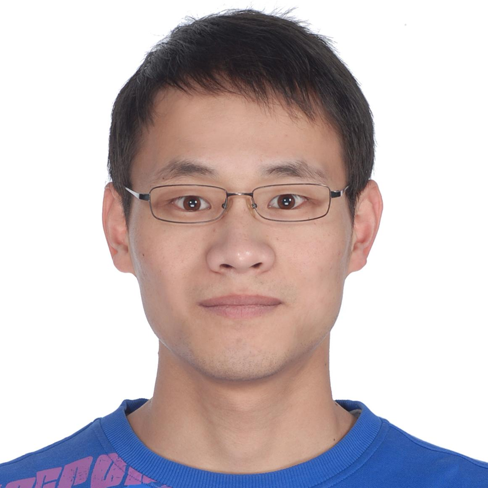

<!--

<table class="imgtable">
    <tr>
        <td style="width:256px">
             
        </td>
            
        <td align="left">
            
<h5>Jingwei Liang (梁经纬)</h5>  <a href="https://ins.sjtu.edu.cn/" >Institute of Natural Sciences</a> and <a href="https://www.math.sjtu.edu.cn" >School of Mathematical Sciences</a>    <a href="https://www.sjtu.edu.cn/">Shanghai Jiao Tong University</a>  

        </td>
	</tr>
</table>

-->

## Contact
- E-mail: firstname dot lastname AT sjtu dot edu dot cn
- Office: Room 355, No. 6 Science Building 

## Research interests
&emsp; Non-smooth Optimization, Mathematical Imaging and Data Science.

## Short bio
- <b>Tenure-track Associate Professor</b>   &ensp; Institute of Natural Science and School of Mathematical Sciences, Shanghai Jiao Tong University.
- <b>Lecturer in Mathematical Data Science</b> (2020.11-2021.06)   &ensp; School of Mathematical Sciences, Queen Mary University of London.
- <b>Postdoc research associate</b> (2017.04-2020.08)   &ensp; Department of Applied Mathematics and Theoretical Physics, University of Cambridge.
- <b>Ph.D. in Mathematics</b> (2016.10)   &ensp; GREYC, ENSICAEN and University of Caen Normandy. 
<!-- - <b>M.S. in Mathematics</b> (2013.03)   &ensp; School of Mathematics & Institute of Natural Sciences, Shanghai Jiao Tong University.  -->
<!-- - <b>B.S. in Electrical & Information Engineering</b> (2010.06)   &ensp; School of Telecommunication and Information Engineering, Nanjing University of Posts and Telecommunications. -->

