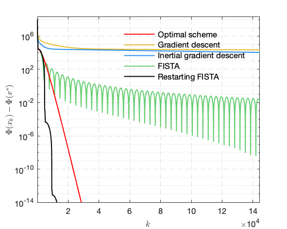

<!-- ### Gradient descent and its variants -->
Here, we present simple comparison on gradient descent and its variants (heavy-ball method, Nesterov's accelerated scheme and restarting FISTA) when applying to solve a simple least square estimation problem which is described below
\\[
\min_{x \in \mathbb{R}^n} \{ F(x) = \tfrac{1}{2} \\|Ax - b\\|^2 \}  ,
\\]
where \\(b \in \mathbb{R}^n\\) and \\(A \in \mathbb{R}^{n\times n}\\) is of the form
\\[
A =
\begin{bmatrix}
2 & -1 & & &   \\\\ 
-1 & 2 & -1 & &   \\\\ 
&  & \dotsm & & \\\\ 
& & -1 & 2 & -1  \\\\ 
& & & -1 & 2  \\ 
\end{bmatrix}_{n}   .
\\]

The gradient descent for sovling the above problem would be 
\\[
\begin{align}
x_{k+1} &= x_k - \gamma \nabla F(x_k) \\\\ 
&= x_k - \gamma A^T (Ax_k - b) .
\end{align}
\\]


In the experiment, consider \\(n = 50\\) and simply set \\(b = 0\\).

**Creating matrix \\(A\\)**
``` matlab
A = 2*eye(n) - diag(ones(n-1,1), -1) - diag(ones(n-1,1), 1);
```

**Parameters** All the parameters of the algorithm will be stored in a structure +para+
```matlab
para.n = n; % dimension of the problem
para.gamma = 1.0 /norm(A)^2; % step-size
para.maxits = 1e6 + 1; % maximum number of iteration
para.tol = 1e-16; % stopping criterion for ||x_{k}-x_{k_1}||
para.x0 = 1e4*ones(n, 1); % starting point
```

**Gradient and objective function**
The gradient and objective function will be dealt by MATLAB function handle
```matlab
% define function handles
objF = @(x) norm(A*x-b)^2 /2;
gradF = @(x) (A')*(A*x - b);
```

***m-file* source code for gradient descent** The code for gradient descent is written in a solo file.
```matlab
% funciton for gradient descent
function [x, its, ek, fk] = func_GD(para, gradF, objF)

% this function returns
%    x the solution of the problem
%    total number of iteration needed to reach the stopping criterion
%    history of ||x_{k} - x_{k-1}||
%    history of objective function value F(x_{k})

% get the parameters
n = para.n;
gamma = para.gamma;
tol = para.tol;
maxits = para.maxits;

ek = zeros(maxits, 1); % record ||x_{k}-x_{k-1}||
fk = zeros(maxits, 1); % record objective function value

x = para.x0; % set the initial point

its = 1;
while(its<maxits)

    fk(its) = objF(x);

    x_old = x;
    x = x - gamma*gradF(x);

    %%%%%%% compute residual and checking stopping criterion
    res = norm(x_old-x, 'fro');
    ek(its) = res;

    if (res/prod(n)<tol)||(res>1e10); break; end

    its = its + 1;

end
fprintf('\n');

ek = ek(1:its-1);
fk = fk(1:its-1);
```


***m-file* source code for FISTA**
```matlab
% function for FISTA
function [x, its, ek, fk] = func_FISTA(para, gradF, objF)

% this function returns
%    x the solution of the problem
%    total number of iteration needed to reach the stopping criterion
%    history of ||x_{k} - x_{k-1}||
%    history of objective function value F(x_{k})

% get the parameters
n = para.n;
gamma = para.gamma;
tol = para.tol;
maxits = para.maxits;

ek = zeros(maxits, 1); % record ||x_{k}-x_{k-1}||
fk = zeros(maxits, 1); % record objective function value

x = para.x0; % set the initial point
y = x;
t = 1; % for FISTA parameter updates

its = 1;
while(its<maxits)

    fk(its) = objF(x);

    x_old = x;
    x = y - gamma*gradF(y);

    % computing the FISTA parameter
    t_old = t;
    t = (1 + sqrt(1+4*t_old^2)) /2;
    a = min(1, (t_old-1) /t);

    % extrapolation update
    y = x + a*(x-x_old);

    %%%%%%% compute residual and checking stopping criterion
    res = norm(x_old-x, 'fro');
    ek(its) = res;

    if (res/prod(n)<tol)||(res>1e10); break; end

    its = its + 1;

end
fprintf('\n');

ek = ek(1:its-1);
fk = fk(1:its-1);
```
Similarly, we can write the code for heavy-ball method and restarting FISTA.

**Comparison** The numerical comparison of *gradient descent, inertial gradient descent, FISTA and restarting FISTA* is illustrated in the figure below.


**Codes for solving LASSO problem** It is very easy to have the code for LASSO problem once we have the code for gradient descent, as we only need to change
```matlab
% gradient descent
x = x - gamma*gradF(x);
```
to
```matlab
% proximal gradient descent
x = wthresh( x - gamma*gradF(x), 's', mu*gamma);
```
where \\(\mu\\) is the tradeoff parameter in front of the \\(\ell_1\\)-norm.


<!-- #### Math equations


##### The Quadratic Formula
\\[x = {-b \pm \sqrt{b^2-4ac} \over 2a}.\\]

##### Cauchy's Integral Formula
\\[f(a) = \frac{1}{2\pi i} \oint\frac{f(z)}{z-a}dz\\]

##### Double angle formula for Cosines
\\[ \cos(θ+φ)=\cos(θ)\cos(φ)−\sin(θ)\sin(φ) \\]

##### Gauss' Divergence Theorem
\\[ \int_D ({\nabla\cdot} F)dV=\int_{\partial D} F\cdot ndS \\]

##### Curl of a Vector Field
\\[
\vec{\nabla} \times \vec{F} =
\left( \frac{\partial F_z}{\partial y} - \frac{\partial F_y}{\partial z} \right) \mathbf{i} + \left( \frac{\partial F_x}{\partial z} - \frac{\partial F_z}{\partial x} \right) \mathbf{j} + \left( \frac{\partial F_y}{\partial x} - \frac{\partial F_x}{\partial y} \right) \mathbf{k}
\\]

##### Standard Deviation
\\[\sigma = \sqrt{ \frac{1}{N} \sum_{i=1}^N (x_i -\mu)^2} \\]

##### Definition of Christoffel Symbols
\\[(\nabla_X Y)^k = X^i (\nabla_i Y)^k =
X^i \left( \frac{\partial Y^k}{\partial x^i} + \Gamma_{im}^k Y^m \right)\\]


#### Equation referencing \eqref{eq:circle}

\\[\label{eq:circle} \tag{1}
x^2 + y^2 = 1.
\\]
 -->


