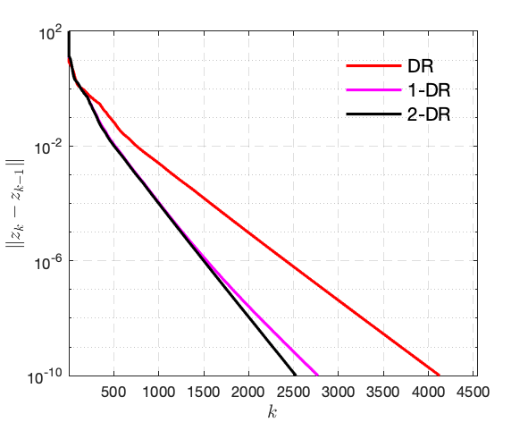
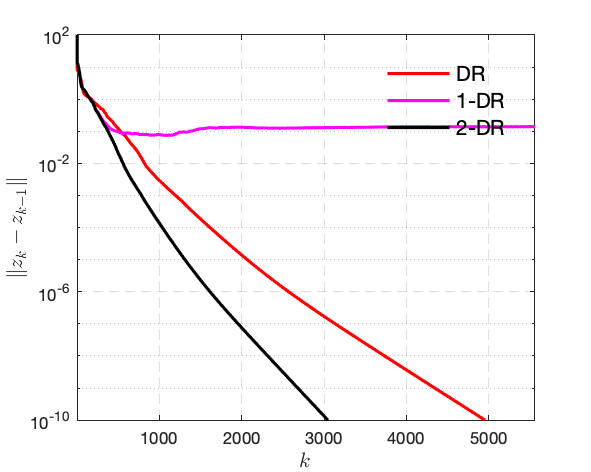

In this project, we will apply several classic operator splitting schemes to solve the Principal Component Pursuit (PCP, a.k.a. Robust Principal Component Analysis) problem, proposed by Candès, Li, Ma and Wright, 2009. 

### 1. Forward model

Suppose we have the following observation 
\\[\tag{1}
\label{eq:forward}
f = x + y + \epsilon  , 
\\]
where \\(x \in \mathbb{R}^{m \times n}\\) is a sparse matrix, \\(y \in \mathbb{R}^{m \times n}\\) is a low-rank matrix and \\(\epsilon \in \mathbb{R}^{m \times n}\\) is white Gaussian noise. The goal is to recover the sparse and low-rank components from the observation \\(f\\). There are various formulations of this decomposition, in the following we mainly focus on several convex approaches. 

### 2. Noiseless case

When there is no noise, i.e. \\(\epsilon=0\\), the decomposition problem can be achieved via the following constrained convex optimisation problem
\\[\tag{2}\label{eq:pcp-1}
\min\_{x,y\in\mathbb{R}^{m\times n}} \mu \\\|x\\\|\_{1} + \\\|y\\\|\_{*} 
\quad \textrm{s.t.} \quad  
x + y  = f .
\\]
<!-- \\min_{x,y\in\mathbb{R}^{m\timesn}}\mu \\|x\\| _{1}+\\|y\\|_*  -->
For the above problem, there are two methods can be applied: Douglas--Rachford splitting and Backward--Backward splitting with parameter continuation. Throughout the section, consider 
\\[
\mu  = \tfrac{1}{ \sqrt{\max \\{m, n\\}} } .
\\]

Let's first define several notations
\\[\tag{3}\\label{eq:lift}
z = \begin{pmatrix} x \\\\ y \end{pmatrix} \in \mathbb{R}^{2m \times n} ,\quad
R(z) = \mu \\\|{x}\\\|\_1 +  \\\|{y}\\\|\_{*} ,\quad
A = \begin{bmatrix} \mathrm{Id} & \mathrm{Id} \end{bmatrix} .
\\]
Then \eqref{eq:pcp-1} can be written as
\\[\tag{4}
\label{eq:pcp-2}
\min\_{z \in \mathbb{R}^{2m \times n}}  R(z)
\quad
\textrm{s.t.}
\quad
A z  = f .
\\]
Define the set \\(\Omega :=  \\{ z \in \mathbb{R}^{2m \times n} : A z = f \\}\\), then we further get
\\[\tag{5}\label{eq:pcp-3}
\min\_{z \in \mathbb{R}^{2m \times n}} ~ R(z) + \iota\_{\Omega}(z)  ,
\\]
which can be handled by Douglas--Rachford splitting easily. Let \\(z = \begin{pmatrix} z\_1 \\\\ z\_2 \end{pmatrix}\\)
- The proximal mapping of \\(R\\)
	\\[
	\mathrm{prox}\_{\gamma R} (z)
	=
	\begin{pmatrix}  \mathrm{prox}\_{\gamma\mu \\\|{\cdot}\\\|\_1} (z\_1) \\\\  \mathrm{prox}\_{\gamma \\\|{\cdot}\\\|\_*} (z\_2)  \end{pmatrix}  .
	\\]
- The projection mapping onto \\(\Omega\\)
	\\[
	\mathrm{proj}\_{\Omega} (z) = z + A^T (AA^T)^{-1}(f - Az)   .
	\\]

Therefore, the iteration of Douglas--Rachford the reads: let \\(\gamma > 0\\), \\(z\_{1,0} = 0, z\_{2,0} = f\\) and \\(v = \mathrm{proj}\_{\Omega} (z\_0) \\) 
\\[
\begin{aligned}
u\_{1,k+1} &= \mathcal{T}\_{\gamma\mu} ( 2v\_{1,k} - z\_{1,k} ) 	\\\\ 
u\_{2,k+1} &= U \mathcal{T}\_{\gamma} ( \Sigma ) V^T	\\\\ 
z\_{1,k+1} &= z\_{1,k} + u\_{1,k+1} - v\_{1,k}	\\\\ 
z\_{2,k+1} &= z\_{2,k} + u\_{2,k+1} - v\_{2,k}	\\\\ 
v\_{k+1} &= \mathrm{proj}\_{\Omega} (z\_{k+1})  ,
\end{aligned}
\\]
where \\(\mathcal{T}_{\gamma}(\cdot)\\) is the soft-thresholding operation and \\(U\Sigma V^T\\) is the SVD of \\(2v\_{2,k} - z\_{2,k}\\).

<!-- - *Numerical goal* The goal of this realisation is:
- . Implement the Douglas--Rachford splitting method;
- . Implement the multi-step inertial acceleration for Douglas--Rachford
        - $1$-step inertial scheme: choose inertial parameter as $0.1$;
        - $2$-step inertial scheme: choose inertial parameters as $(0.2, -0.1)$.
- For both implementations, observe the convergence of $\|{z_{k}-z_{k}m}\|$. -->

<!-- # ==== 2.2 Backward--Backward splitting with parameter continuation
#
# By adding an auxiliary variable $w$, we can reformulate $\eqref{eq:pcp-4}$ as
# \(
# \begin{equation}\label{eq:pcp-4}
# \min_{z \in \mathbb{R}^{2m \times n}} ~ R(z) + \iota_{\Omega}(w)
# \quad
# \textrm{s.t.}
# \quad
# z  = w .
# \end{equation}
# \)
# This time for the equality constraint, we can consider penalising it to the objective function, which leads to
# \(
# \begin{equation}\label{eq:pcp-5}
# \min_{z, w \in \mathbb{R}^{2m \times n}} ~ R(z) + \tfrac{\lambda}{2} \|{z-w}\|^2 + \iota_{\Omega}(w)  .
# \end{equation}
# \)
# To enforce the constraint, one should choose $\lambda = +\infty$ which is impossible in practice. Possible approaches to cope with such problem is:
#     - choose a large enough value for $\lambda$;
#     - initialise $\lambda$ with a relative small value and the progressively increase the value.
#
# When fixing $z$, $\eqref{eq:pcp-5}$ becomes
# \(
# \begin{equation*}
# \min_{w}~\iota_{\Omega}(w) + \tfrac{\lambda}{2} \|{z-w}\|^2
# = \min_{w}~\iota_{\Omega}(w) + \tfrac{1}{2\times 1/\lambda} \|{z-w}\|^2
# = {}^{\lambda^{-1}}\left({ \iota_{\Omega}(z) }\right)
# \end{equation*}
# \)
# which is the Moreau envelope of $\iota_{\Omega}(w)$ indexed by $\lambda^{-1}$. This means that
# $\nabla \left({ {}^{\lambda^{-1}} ({ \iota_{\Omega}(w) }) } \right) =  \lambda (\mathrm{Id} - \mathrm{proj}_{\Omega})  $
# is $\lambda$-Lipschitz continuous.
#
# The problem we need to solve now reads
# \(
# \begin{equation}\label{eq:pcp-6}
# \min_{z \in \mathbb{R}^{2m \times n}} ~ R(z) + {}^{\lambda^{-1}}\left({ \iota_{\Omega}(z) }\right)   .
# \end{equation}
# \)
# The Forward--Backward splitting method for solving this problem reads: $\gamma \in ]0, 2/\lambda]$
# \(
# \begin{equation}\label{eq:bb-1}
# \begin{aligned}
# g_{k} &= z_{k} - \gamma \lambda \left({ z_{k} - \mathrm{proj}_{\Omega}(z_{k}) }\right)    \\
# z_{k+1} &= \mathrm{prox}_{\gamma R}(g_{k})     .
# \end{aligned}
# \end{equation}
# \)
# The above iteration becomes Backward--Backward splitting when $\gamma\lambda = 1$, \ie $\gamma = 1/\lambda$.  It solves $\eqref{eq:pcp-5}$ with a predetermined $\lambda$ which should be large enough.
# To apply the continuation technique, consider the following iteration: let $\lambda_0 > 0,~ \gamma \in ]0, 2/\lambda_0]$ and $\alpha > 1$
# \(
# \begin{equation}\label{eq:bb-2}
# \begin{aligned}
# g_{k} &= z_{k} - \gamma_k \lambda_k \left({ z_{k} - \mathrm{proj}_{\Omega}(z_{k}) }\right)    \\
# z_{k+1} &= \mathrm{prox}_{\gamma_k R}(g_{k})     \\
# \lambda_{k+1} &= \alpha \lambda_{k} \\
# \gamma_{k+1} &= \gamma_{k} / \alpha  .
# \end{aligned}
# \end{equation}
# \) -->

### 3. Noisy case

When \\(\epsilon \neq 0\\), then instead of the constrained optimisation problem, we need to consider the following regularised least square
\\[\tag{6}\label{eq:pcp-7}
\min\_{x, y \in\mathbb{R}^{m\times n}}~ \nu \big({ \tfrac{1}{ \sqrt{ \max \\{m,n\\} } } \\\|{x}\\\|\_1 +  \\\|{y}\\\|\_* }\big)  + \tfrac{1}{2}\\\|{ x + y - f }\\\s|^2  ,
\\]
where \\(\nu > 0\\) is tradeoff parameter.
Follow the definitions in \eqref{eq:lift}, we obtain the following simpler formulation
\\[\tag{7}\label{eq:pcp-8}
\min\_{z \in\mathbb{R}^{2m\times n}}~ \nu R(z)  + \tfrac{1}{2}\\\|{ Az - f }\\\|^2  ,
\\]
which can be easily handled by Forward--Backward splitting and FISTA.

Now again, by applying the Moreau envelope trick, \eqref{eq:pcp-7} is equivalent to
\\[\tag{8}\label{eq:pcp-9}
\min\_{x \in \mathbb{R}^{m\times n}}~ \tfrac{\nu}{ \sqrt{ \max \\{m,n\\} } } \\\|{x}\\\|\_1 + { ^1\left({ \nu \\\|{\cdot}\\\|\_1}\right)(f-x) }  ,
\\]
where \\({ ^1\left({ \nu \\\|{\cdot}\\\|\_1}\right)(f-x) }\\) is the Moreau envelope parameterised by \\(1\\), hence its gradient is \\(1\\)-Lipschitz.

### 4. MATLAB implementation

*Generating \\(f\\) based on \eqref{eq:forward}*  	
~~~matlab
n = [32, 32]; % dimension of matrix

% low-rank matrix
r = 4; 
xl0 = rand(n(1),r)*diag(r:-1:1)*rand(r,n(2));
xl0 = xl0/max(abs(xl0(:))) *50;

% sparse matrix, sparsity = 0.2
xs0 = rand(n)*rand(n);
xs0 = xs0/max(abs(xs0(:))) *50;

ratio = 0.2; 
mask = proj_mask(xs0, ratio, 'p');
xs0 = xs0 .* mask;

% exact observation
f0 = xs0 + xl0;

% generate noise
sigma = 1e-2*std(f0(:));

% noisy observation
f = xs0 + xl0 + sigma*randn(n); % comment this line for the exact scenario
~~~

Details of the codes can be found [here](projects/src_Project2.zip). In the following, we mainly demonstrate the numerical performance comparison. 

#### 4.1 Exact case and Douglas--Rachford splitting

The numerical comparison of *Douglas--Rachford and its inertial versions* is illustrated in the figure below.
- *1-DR* inertial parameter \\(a = [0.4, 0]\\).
- *2-DR* inertial parameter \\(a = [0.5, -0.1]\\).
    
| Example 1: two inertial versions are almost the same | Example 2: 2-step iDR is faster |
| :-: | :-: |
|  |  | 

<!-- Example for which two inertial versions are almost the same.

Example for which $2$-step inertial DR is much faster under the same parameter choices.

 -->

#### 4.2 Noiseless case and Forward--Backward splitting/FISTA

Numerical comparison of *Forward--Backward and FISTA*. 

